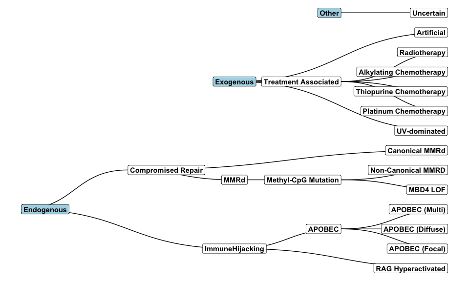

MOLON Ontology Package
================
Your Name
2024-05-23

# MOLON Ontology Package

The MOLON Ontology describes mechanisms driving distinct mutational
profiles in cancer.

This package makes it easy to load and visualize the MOLON ontology

## Installation

You can install the development version of the MOLON Ontology Package
from GitHub with:

``` r
# install.packages("devtools")
devtools::install_github("yourusername/molon")
```

## Quick Start

``` r
library(molon)

# Visualise
graph_ontology()
```

<!-- -->

Load the ontology as a data.frame

``` r
load_ontology()
```

    ##                       Term               Parent
    ## 1          ImmuneHijacking           Endogenous
    ## 2       RAG Hyperactivated      ImmuneHijacking
    ## 3                   APOBEC      ImmuneHijacking
    ## 4           APOBEC (Focal)               APOBEC
    ## 5         APOBEC (Diffuse)               APOBEC
    ## 6           APOBEC (Multi)               APOBEC
    ## 7       Compromised Repair           Endogenous
    ## 8                     MMRd   Compromised Repair
    ## 9      Methyl-CpG Mutation                 MMRd
    ## 10                MBD4 LOF  Methyl-CpG Mutation
    ## 11      Non-Canonical MMRD  Methyl-CpG Mutation
    ## 12          Canonical MMRd   Compromised Repair
    ## 13            UV-dominated            Exogenous
    ## 14    Treatment Associated            Exogenous
    ## 15   Platinum Chemotherapy Treatment Associated
    ## 16 Thiopurine Chemotherapy Treatment Associated
    ## 17 Alkylating Chemotherapy Treatment Associated
    ## 18            Radiotherapy Treatment Associated
    ## 19               Uncertain                Other
    ## 20              Artificial            Exogenous
    ##                                                                               Description
    ## 1                 immune system activity is the dominant force driving mutational profile
    ## 2                                   More than 10% of structural variants  are RAG-induced
    ## 3                          Profile contains substantial contributions of APOBEC mutations
    ## 4        Patient has >10% of their profile APOBEC present with APOBEC (kataegis excluded)
    ## 5                 Patient has at least 1 region of kataegis enriched for APOBEC mutations
    ## 6                                                      Patient has both Focal and Diffuse
    ## 7                                                                                        
    ## 8                     A reduced ability to protect sites from, or repair small mismatches
    ## 9                    Profile is dominated by mutation or failure to repair methyl-CpG\xca
    ## 10                                                    Patient has double hit loss of MBD4
    ## 11 High TMB, High SBS1 contribution, moderate model error, mutations in MutS_ (MSH2/MSH6)
    ## 12                                                   High TMB, LOF mutations in MMR genes
    ## 13                                                                              High SBS7
    ## 14                                 Mutational profile derived from genotoxic therapeutics
    ## 15                         > 10% of mutations generated by platinum chemotherapy exposure
    ## 16                                > 10% of mutations generated by thiopurine chemotherapy
    ## 17                                > 10% of mutations generated by alkylating chemotherapy
    ## 18                                           > 10% of mutations generated by radiotherapy
    ## 19                                     Mechanism driving the molecular profile is unknown
    ## 20
